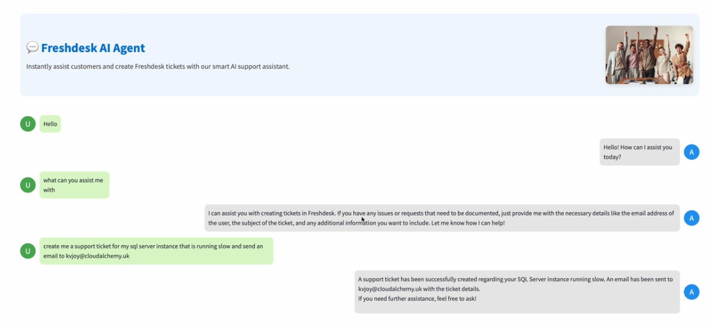
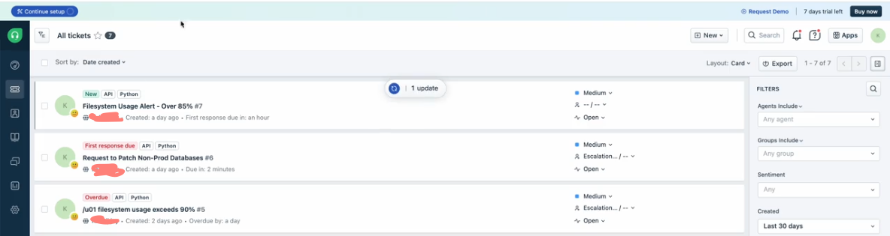

## Freshdesk AI Agent (Azure + Streamlit)

### 1️⃣ Setup & Auth

Load environment variables

Authenticate with ClientSecretCredential

Connect to Azure using AIProjectClient

### 2️⃣ UI (Streamlit)

Create chat layout (banner, bubbles, input box)

Maintain chat history in st.session_state

### 3️⃣ Freshdesk Function

Define create_freshdesk_ticket() → calls Freshdesk API

Returns ticket details in JSON

### 4️⃣ Agent Setup

Register function as FunctionTool

Add to ToolSet and enable auto function calling

Create agent (gpt-4o-mini) with Freshdesk capability

### 5️⃣ Chat Flow

User sends message

Agent processes it via create_and_process_run()

Fetch and display AI response in chat UI

### 💡 Key Concepts:
Azure Agent | FunctionTool | Streamlit UI | Freshdesk API | Auto Function Calls

### Stream Lit APP

### Fresh Desk Portal

Ticket is raised in Fresh Desk and also an email is sent
